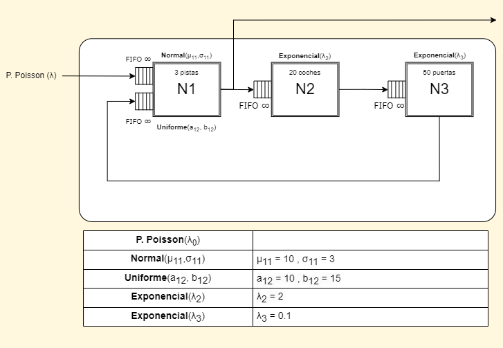

# Simulación de Sucesos Discretos en un Aeropuerto
## Descripción del Proyecto

Este proyecto implementa una simulación de sucesos discretos en un aeropuerto donde aviones de distintos destinos llegan y deben esperar para aterrizar y desembarcar. La simulación se enfoca en modelar y analizar los tiempos de espera y eficiencia en el uso de recursos, como pistas de aterrizaje y vehículos de guía. Los objetivos son:

* Estimar el rendimiento del aeropuerto (tiempos medios y máximos de espera para aterrizar y despegar, uso de las pistas, etc.).
* Evaluar la mejora potencial de agregar una nueva pista o incrementar el número de vehículos guía.

Se ha facilitado un archivo (aterrizajes.txt) con muestras de tiempos de aterrizaje y otro archivo (desembarques.txt) con tiempos de desembarque para analizar y estimar las distribuciones de estos eventos.

## Integrantes del Proyecto

| Integrante             | Email                                 | 
|------------------------|---------------------------------------|
| Ruben González Velasco | ruben.gonzalez.velasco@alumnos.upm.es |
| Ainhoa Ruiz Vitte      | a.rvitte@alumnos.upm.es               |
| Omar Teixeira González | omar.teixeira.gonzalez@alumnos.upm.es |

## Modelización del problema

